# risyu_checker

## 手順
1. Docker Desktopのインストール
2. コンテナのビルド
   ```bash
   docker compose build
   ```
3. コンテナの起動
   ```bash
   docker compose up -d
   ```
4. DBの作成
   ```bash
    docker compose exec web rails db:create
    ```

5. マイグレーションの実行
    ```bash
    docker compose exec web rails db:migrate
    ```
6. ログイン画面の表示
   ```bash
    http://localhost:3000
    ```

## ER図
